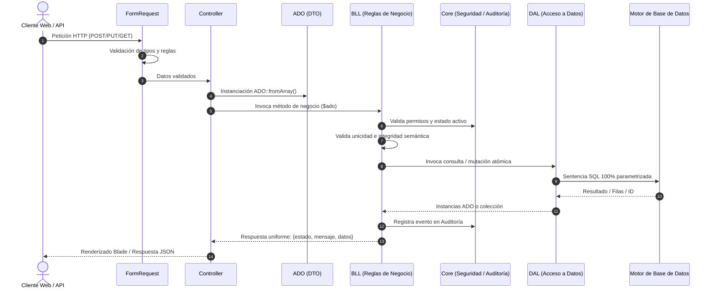

# Especificación de Arquitectura — Algoritmo Framework (Laravel 12 / PHP 8.2)

## 1. Visión y Principios
**Algoritmo Framework** es un Core desacoplado diseñado para ser instalado sobre proyectos base de **Laravel 12**. Introduce una arquitectura empresarial limpia (**Clean Architecture**) en capas:

$$\text{FormRequest} \longrightarrow \text{Controller} \longrightarrow \text{ADO} \longrightarrow \text{BLL} \longrightarrow \text{DAL} \longrightarrow \text{Base de Datos}$$

### Principios Fundamentales:
* **Separación Estricta de Responsabilidades:** Ninguna capa realiza tareas que correspondan a otra.
* **Inmutabilidad y Tipado Estricto:** Código PHP 8.2 con `declare(strict_types=1);` y tipos explícitos en parámetros y retornos.
* **Controladores Delgados (Thin Controllers):** Los controladores únicamente coordinan la entrada y la salida.
* **Independencia de la Base de Datos:** Toda consulta SQL o Query Builder reside exclusivamente en `DAL`.
* **Respuestas Estandarizadas:** Formato JSON y arreglo de negocio uniforme en todo el sistema.

---

## 2. Diagrama de Capas y Flujo de Peticiones

---

## 3. Descripción de Componentes del Core (`app/Core/`)

* **`ResponseHelper`:** Formateador unificado de respuestas exitosas, errores y respuestas paginadas para DataTables.
* **`BusinessException`:** Excepción tipada para violaciones de reglas de negocio, con código HTTP y arreglo de errores semánticos.
* **`SecurityService`:** Criptografía de contraseñas (`Hash::make`, `Hash::check`), sanitización de entradas, generación de tokens y contexto de sesión.
* **`AuditService`:** Registro atómico e inmutable de eventos sensibles (`CREAR`, `ACTUALIZAR`, `ELIMINAR`, `LOGIN`, `CAMBIO_PASSWORD`).
* **`PermissionService`:** Evaluación de roles (`superadmin`, `admin`, `operador`, `consulta`) y validación de acceso multi-tenant (`empresa_id`).
* **`MailService`:** Envío estructurado de correos HTML y plantillas Blade con soporte de adjuntos y logs.
* **`LogService`:** Registro contextual enriquecido con usuario, empresa e IP.

---

## 4. Módulos Iniciales Incluidos

### 4.1. Módulo Empresas
* **ADOEmpresa:** DTO con `id`, `nit`, `razon_social`, `direccion`, `telefono`, `email`, `activo`.
* **EmpresaDAL:** Consultas parametrizadas y paginación server-side para DataTables.
* **EmpresaBLL:** Validación de unicidad de NIT, integridad referencial con usuarios y auditoría.
* **EmpresaController:** Control RESTful completo.
* **Vistas:** `index` (con DataTable), `create`, `edit`, `show`.

### 4.2. Módulo Usuarios del Sistema & Login
* **ADOUsuario / ADOLogin:** DTOs tipados.
* **LoginDAL / UsuarioDAL:** Consultas seguras y búsqueda con join a empresas.
* **LoginBLL:** Flujo de autenticación sin Auth en controladores, verificación de usuario y empresa activa, remember token y auditoría.
* **UsuarioBLL:** CRUD completo, validación de correos y documentos, cambio de contraseña.
* **LoginController / UsuarioController:** Controladores desacoplados.
* **Vistas:** `login`, `index`, `create`, `edit`, `show`, `cambiar-password`.
